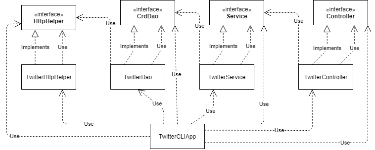

# Twitter CLI App
## Introduction
This app is an exploratory project in using the Twitter's REST API. It performs three basic functions of the Twitter API: posting tweets, deleting tweets by ID, and searching tweets by ID. The project also incorporates some Spring framework and SpringBoot, providing some options in generating dependencies. Integration and unit tests are also included for each major component. These were written using JUnit and Mockito. 

## Quick Start

### Accessing the Twitter API
A Twitter Developer account and application keys are required for the app to sign requests. Set the appropriate environmental variables as below.  
```
export consumerKey={key}
export consumerSecret={key}
export accessToken={key}
export tokenSecret={key}
```
  
### Building with maven
A complete POM.xml is included. The project can be built with `mvn package`. Note that Maven will attempt to run the packaged tests during the build. These will fail if you have not set the required access keys.

### Program execution
Once the program has been successfully built, you will find the .jar in the /target directory. Use the following commands to execute the package:
```  
java -jar (jar name).jar post|show|delete [args]  
  
Argument formats:  
post "(tweet text)" latitude:longitude  
e.g.  
java -jar twitter-1.0-SNAPSHOT.jar post "showing off #test" 34.2:21.5  
  
show (Tweet ID) (fields to show)  
e.g.  
java -jar twitter-1.0-SNAPSHOT.jar show "1097607853932564480" "id_str,text"  
  
delete (Tweet IDs)  
e.g.  
java -jar twitter-1.0-SNAPSHOT-.jar delete "1097607853932564480,1097607853932564481"
```  
  
Argument constraints:  
- Length of a provided ID cannot exceed 19 characters.  
- Length of a Tweet cannot exceed 280 characters.  
- Latitude is in a range of -90 to 90.  
- Longitude is in a range of -180 to 180.  
- Tweet texts and multiple IDs must be enclosed in double quotes.  
  
## Design  
  
  
### App Component  
This is the main execution component. All other major components are instantiated here. The request listed in arguments is processed and the Controller is called to handle it appropriately. This component also handles pretty-printing of results.  
  
### Controller Component  
The Controller component further processes the provided arguments and separates them into variables. It then calls on the Service component to perform the requested task.  
  
### Service Component
The Service component is where the program arguments are validated for the final time before execution. If valid, it will invoke the DAO to construct the final request and execute it.

### DAO Component
This is where the request URIs are finally constructed and sent to the HttpHelper. It is also where responses are parsed from Entity form into Tweet objects for later viewing.

### HttpHelper
The HttpHelper is where requests are finally signed by an OAuth consumer and executed. It will return results back to the DAO component.  
  
## Spring  
This app utilizes a Component Scanning approach with Spring framework to manage dependencies. The classes within the package are annotated as Component, Repository, Service, or Controller as appropriate. All component-annotated classes also have their constructors annotated as Autowired, instructing the IoC container to inject dependencies through it. Finally, a configuration file sets up the IoC container.  
  
## Models  
The Tweet model and its sub-objects are implemented using POJOs. Not all fields from the Twitter API Tweet model are included, just the most relevant ones for the purposes of this project.  
```
Fields:  
created_at  
id_str  
text  
retweet_count  
favorite_count  
favorited  
retweeted  

Sub-objects:  
entities
	hashtags  
	user_mentions  
coordinates  
```  
  
## Improvements  
1. Implement GUI to make argument entry seamless.  
2. Add different search options, like looking up recent Tweets by a screen name.  
3. Expand functionality to other Tweet interactions
